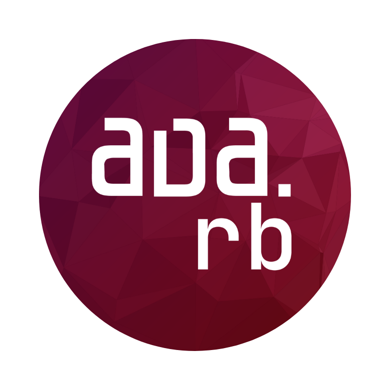

  

### Hi, I'm **`Rodrigo Serradura`** 👋

I build Ruby and Rails tools and write about software architecture. For years I've been chasing one question:

> How do you **`keep`** a codebase **`simple to change`** as it grows?

I've been building with Ruby since 2010, these days on large production Rails systems. I also founded a community for people who like arguing about this stuff.

The question has a new edge to it now. Good architecture used to be a favor you did for the next human who'd open the file. The next reader might be an AI agent instead, and it turns out the **`things that make code easy for a person`** to navigate are mostly the same things that **`make it cheap for an agent to reason about`**.

That overlap is what most of my recent work is about: [Rails Whey](https://github.com/railswhey) and [Solid Process](https://github.com/solid-process) (which evolved from my earlier work on [μ-gems](https://github.com/u-gems)).

  
  &nbsp;&nbsp;&nbsp;&nbsp;
  
  &nbsp;&nbsp;&nbsp;&nbsp;
  
  &nbsp;&nbsp;&nbsp;&nbsp;
  

## 🦾 Rails Whey

[railswhey/app](https://github.com/railswhey/app) is the one I'm proudest of: the same Rails app built 28 different ways. Each branch applies a single architectural rule, **`from fat controller`** all the way **`to bounded contexts`** with separate databases, using nothing but what Rails ships with. No gems. No imported architecture.

Every branch carries its own deep-dive README: the rule it applies, before-and-after numbers (lines of code, a Rubycritic score), and a section on how the change plays for an AI coding agent. Read it front to back as one story, or jump to whichever branch matches the problem you're staring at right now.

> It's a gift to the community. **`Explore`** it, **`learn`** from it, **`challenge`** it.

## ⚛️ Solid Process

[solid-process](https://github.com/solid-process) is where the newer ideas live. It is **`a way to write business logic`** in Ruby and Rails **`that stays readable as the app scales`**. It's the evolution of [`u-case`](https://github.com/u-gems/u-case): same goal, fewer compatibility constraints, and everything I've learned in the years since.

## 💎 μ-gems

[u-gems](https://github.com/u-gems) is a collection of **`cohesive`**, **`composable`** libraries with a **`functional heart`**. Each one doing a single job and stopping there.

## 👥 Ada.rb

I founded and run [Ada.rb](https://adarb.org/), a community for people who care about **`fundamentals`**, **`architecture`**, **`design`**, and **`AI-assisted development`**. It is also a space where we organize meetups, bringing the community together to share knowledge and experiences.

## 🔗 Find me elsewhere

- [LinkedIn](https://www.linkedin.com/in/rodrigo-serradura/)
- [YouTube](https://www.youtube.com/@rodrigoserradura)
- [X (Twitter)](https://x.com/serradura)
