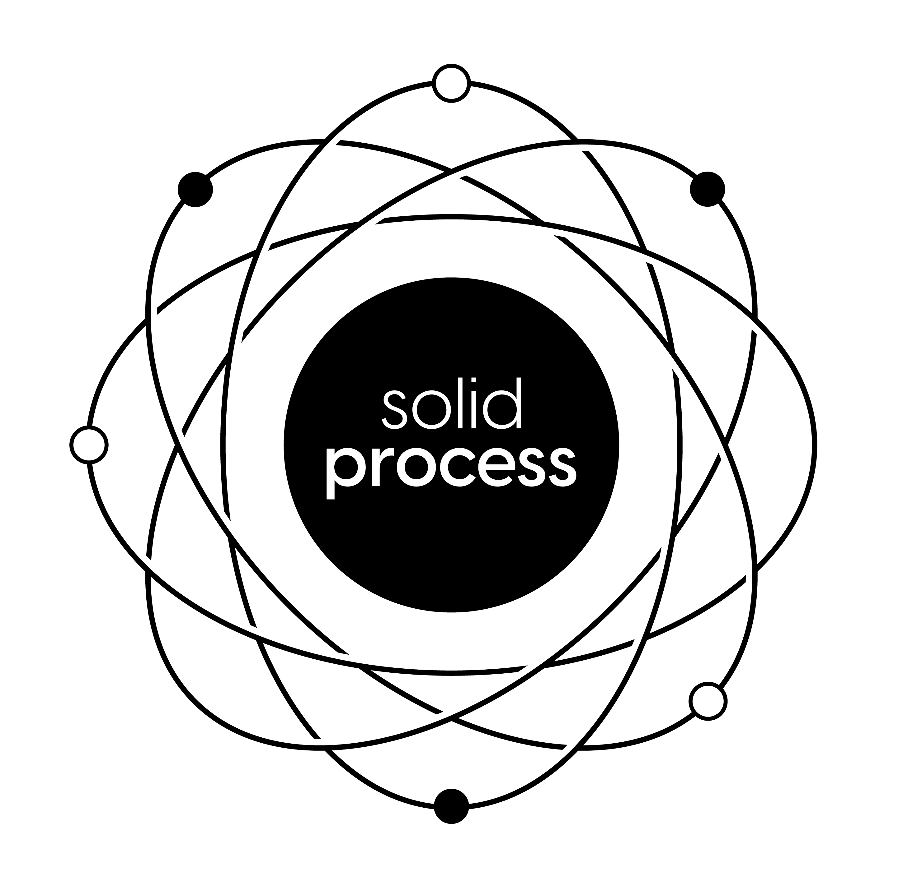
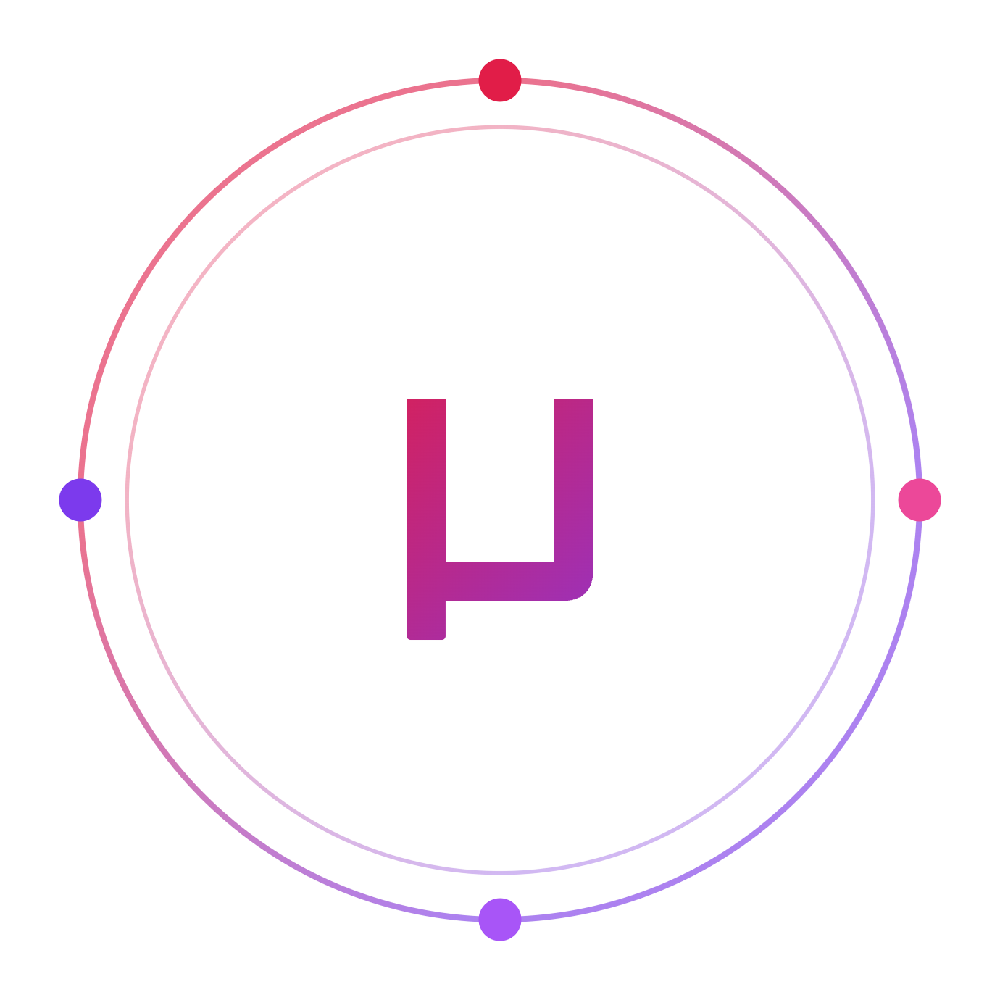

  

### Hi, I'm Rodrigo Serradura 👋

I build Ruby and Rails tools and write about software architecture. For years I've been chasing one question: how do you keep a codebase easy to change as it grows?

I've been building with Ruby since 2010, these days on large production Rails systems. I also founded a community for people who like arguing about this stuff.

The question has a new edge to it now. Good architecture used to be a favor you did for the next human who'd open the file. The next reader might be an AI agent instead, and it turns out the things that make code easy for a person to navigate are mostly the same things that make it cheap for an agent to reason about. That overlap is what most of my recent work is about.

Right now I'm heads-down on [Rails Whey](https://github.com/railswhey) and [Solid Process](https://github.com/solid-process), the two projects I'd hand someone first. The rest lives across three GitHub orgs.

  
  &nbsp;&nbsp;&nbsp;&nbsp;
  
  &nbsp;&nbsp;&nbsp;&nbsp;
  

## 🦾 Rails Whey

[railswhey](https://github.com/railswhey/app) is the one I'm proudest of: the same Rails app built 28 different ways. Each branch applies a single architectural rule, from one fat controller all the way to bounded contexts with separate databases, using nothing but what Rails ships with. No gems. No imported architecture.

Every branch carries its own deep-dive README: the rule it applies, before-and-after numbers (lines of code, a Rubycritic score from 0 to 100), and a section on how the change plays for an AI coding agent. Read it front to back as one story, or jump to whichever branch matches the problem you're staring at right now.

It's a gift to the community. Explore it, learn from it, challenge it.

## ⚛️ Solid Process

[solid-process](https://github.com/solid-process) is where the newer ideas live. `solid-process` is a way to write business logic in Ruby and Rails that stays readable as the app scales. It's the evolution of `u-case`, my use-case library: same goal, fewer compatibility constraints, and everything I've learned in the years since.

## μ-gems

[u-gems](https://github.com/u-gems) is a home for small Ruby libraries, each one doing a single job and stopping there. The best known is `u-case`: you write a use case as a small object with typed attributes and a `Success(...)` or `Failure(...)` result.

→ [`u-case`](https://github.com/serradura/u-case) has been in production for years, so its public API is frozen. The contracts you depend on today won't move. Any next rethink of those abstractions happens over in Solid Process instead.

## Ada.rb

I founded and run [Ada.rb](https://linktr.ee/ada.rb), a community for people who care about Ruby design, architecture, and AI-assisted development. It's where a lot of these ideas get tested and picked apart before they turn into anything public.

## Find me elsewhere

- [LinkedIn](https://www.linkedin.com/in/rodrigo-serradura/)
- [YouTube](https://www.youtube.com/@rodrigoserradura)
- [X](https://x.com/serradura)
